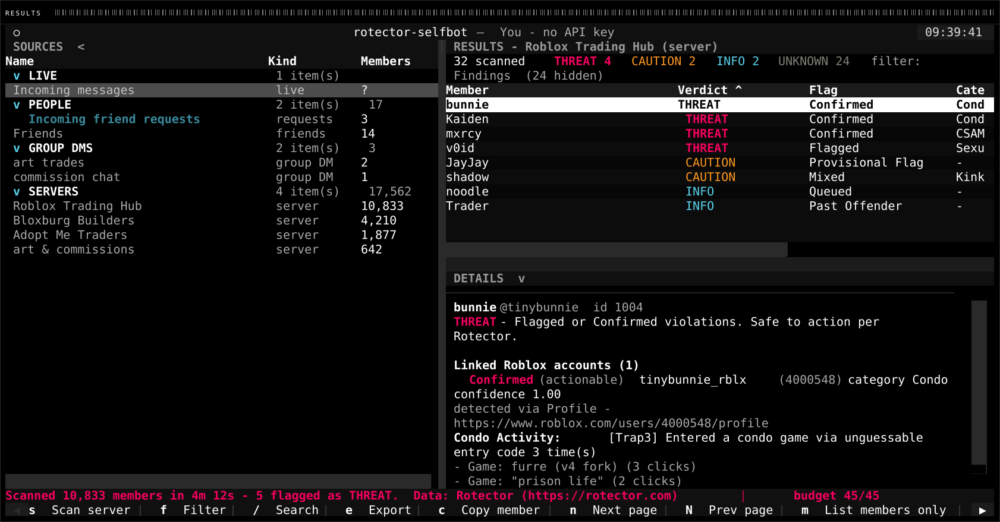
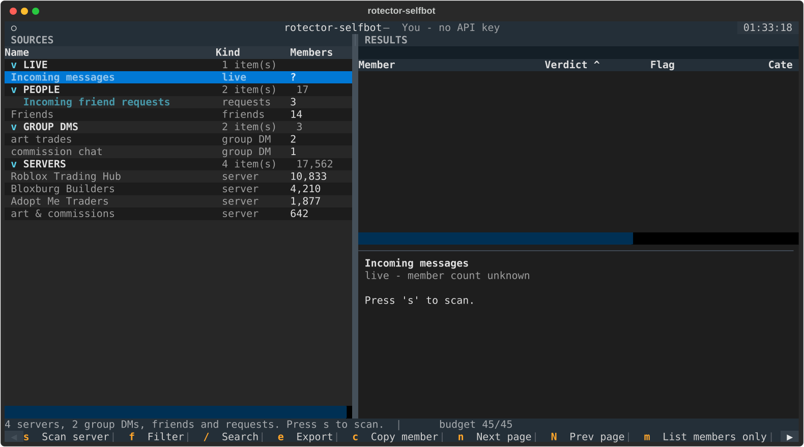
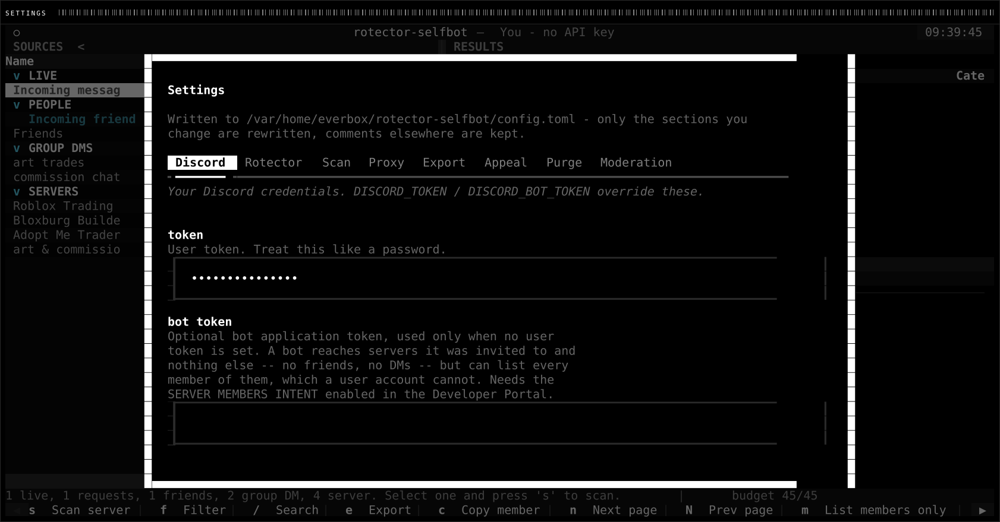
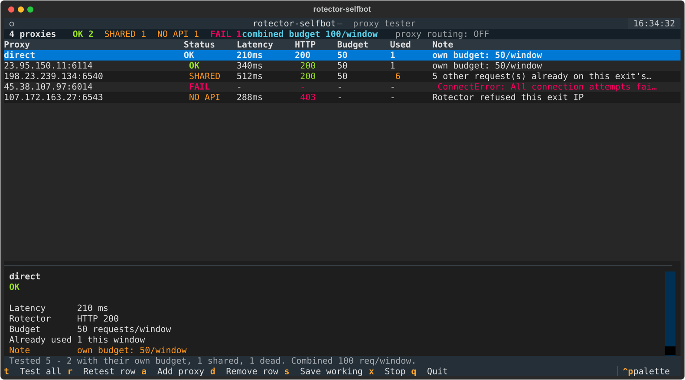
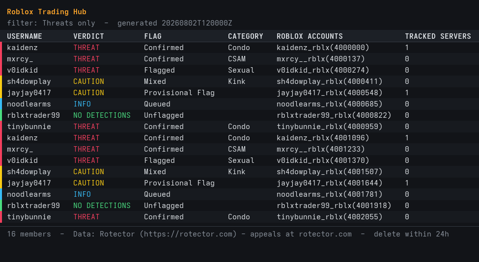
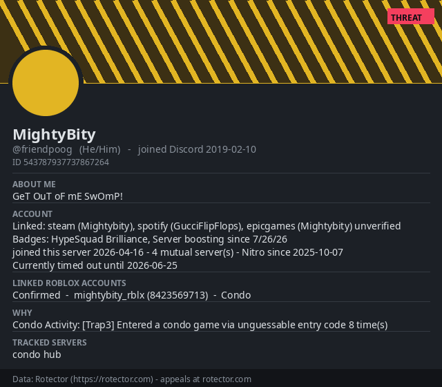

# rotector-selfbot

A terminal UI that lists your Discord **servers, friends, incoming friend
requests and group DMs**, reads the members of whichever you pick, and checks
every one against the [Rotector](https://rotector.com) database — surfacing
accounts with detected violations so you can tell who is a potential threat
before interacting.



Findings only by default — a 10,833-member server lists the handful that matter,
not all of them. Verdict, flag type, category and linked Roblox accounts, with
the full reasons and evidence in the pane below.

| | |
|---|---|
|  |  |
| Servers, friends, requests and group DMs in collapsible groups | Every setting editable in-app; no hand-editing TOML |



Proxies tested against the Rotector API itself, showing which actually bring
their own rate budget and which only look like they do.


## Read this first

**Automating a user account is against Discord's Terms of Service**, whatever
the account is used for. Discord does not carve out an exception for
safety tooling, and accounts caught driving the API this way get disabled.
This tool only ever *reads* — it lists guilds, reads the member sidebar, and
looks ids up — but that is still automation of a user account, and the risk of
losing the account is real and entirely yours. If you have the option, a
regular bot with the `GUILD_MEMBERS` intent does the same job with no ToS
problem; the Rotector half of this codebase works unchanged either way.

**A verdict is not a background check.** `NO DETECTIONS` means Rotector has
not flagged the account *yet* — it is not a clean bill of health, and Rotector's
own terms forbid presenting it as "safe". Only `THREAT` (flag types *Flagged*
and *Confirmed*) is documented as safe to act on automatically.

## Install

Needs **Python 3.11 or newer** — that is where `tomllib` entered the standard
library. Running on anything older stops with a message saying so rather than a
`ModuleNotFoundError` for a module you have never heard of.

**Linux / macOS**

```bash
python3 -m venv .venv
./.venv/bin/pip install -r requirements.txt
./.venv/bin/python -m rsb
```

**Windows** (PowerShell)

```powershell
py -3.11 -m venv .venv
.\.venv\Scripts\pip install -r requirements.txt
.\.venv\Scripts\python -m rsb
```

Use **Windows Terminal** rather than the old `conhost` console window — the UI
needs a terminal with truecolour and mouse reporting, which the legacy console
does not provide.

Everything is pure Python and the dependencies ship wheels for all three
platforms, so there is nothing to compile. Two things vary by machine rather
than by OS:

- **PNG export needs Pillow** and a monospace font. The renderer looks through
  the usual locations on each platform (DejaVu/Liberation/Noto on Linux, Menlo
  and SF Mono on macOS, Consolas on Windows) and falls back to Pillow's own
  face at the right size if it finds none.
- **Updating needs `git` on `PATH`.** Without it the app says so and carries on;
  nothing else depends on it.

Config is read from `./config.toml` first, then from
`%APPDATA%\rotector-selfbot\` on Windows or `~/.config/rotector-selfbot/`
elsewhere. `~/.config` is still searched on Windows too, so an existing install
keeps working.

## Configure

Settings get added between versions, and a config written against an older one
silently falls back to defaults for anything it does not mention. To bring an
existing file up to date:

```bash
./.venv/bin/python -m rsb migrate --dry-run   # list what is missing
./.venv/bin/python -m rsb migrate             # add it
```

It only *appends* what is absent, with each setting's explanatory comment. Your
values, comments and layout are untouched, nothing is reordered, and the
previous file is kept as `config.toml.bak`. Running it twice changes nothing.


```bash
cp config.example.toml config.toml   # then put your token in it
```

Or use the environment, which takes precedence:

```bash
export DISCORD_TOKEN='...'
export ROTECTOR_API_KEY='...'        # optional
```

`config.toml` is gitignored. The token is a full-access credential — treat it
like a password.

### Choosing a backend

Which service answers *"is this member flagged"* is set by `[scan] backend`,
either in the file or from `ctrl+s` → **Scan** → *backend*, which offers the
valid names as a dropdown:

```toml
[scan]
backend = "rotector"   # or "okappiki"
```

They are alternatives, not layers — a scan asks one of them. Switching from the
settings screen takes effect immediately: the lookup client is rebuilt without
signing in again, since the Discord side is unaffected. Results already on
screen are cleared, because a Rotector verdict and an Okappiki one rest on
different evidence and a table holding both would give no way to tell which row
came from where.

**`rotector`** (default) is the documented one. It batches 100 ids per request
inside the published 50 requests / 10 s window, returns flag types whose
actionability is specified, and supports an API key.

**`okappiki`** goes to `okappiki.com`, which queries three services and returns
them together: its own list, Rotector, and mococo. Choosing it does not give up
Rotector's answer — it asks a different service for it.

Two things to know before switching, both of which are the reason it is not the
default:

- **No batch endpoint.** One request covers one member. A 10,000-member server
  is 10,000 requests against Rotector's ~218 for the same list. At the default
  5 requests/second that is roughly half an hour where Rotector takes about a
  minute. The scan estimate reflects this honestly; it is not a surprise you
  discover at member 4,000.
- **Nothing is documented.** The endpoint publishes no rate limit, no version
  and no schema. The defaults under `[okappiki]` are deliberately slow, and the
  client treats every field as optional because an unflagged member's record is
  literally `{"flagged": false}` and nothing else.

Verdicts are tiered by how much the source can support:

| Source | Flagged result | Why |
|---|---|---|
| `rotector` | **THREAT** (flag types 1 and 2) | the only source publishing flag types documented as safe to act on |
| `okappiki` | **CAUTION** | unverified sighting, no flag type to grade it by |
| `mococo` | **CAUTION** | as above; its `score_sum` is shown, not interpreted |

A source that does not appear in a response is recorded as *not having
answered*, which the detail pane says out loud — it is not the same as that
source saying "not flagged", and collapsing the two would let an outage read as
a clean result.

### Staying up to date

The install is a `git clone`, so an update is a fast-forward of the working
copy. The app checks shortly after startup and on `ctrl+u`, and when there is
something new it shows a dialog listing the commits before anything is applied:

- **Nothing is pulled without confirming.** Checking is a read — `git fetch`
  touches no tracked file. Applying moves the code that is about to run, which
  is worth a keypress.
- **Git has to be there.** No git on `PATH`, or no `.git` to pull into, and the
  feature says so in a sentence rather than failing obscurely. `ctrl+u` reports
  that; the startup check stays quiet about it.
- **A modified working copy is never touched.** The merge is `--ff-only`
  against an explicitly fetched upstream, so it either advances cleanly or
  declines. Local edits are yours; commit or stash them and check again.

After a successful update the app hot-reloads what it safely can and says to
restart to finish — the UI modules are deliberately excluded from hot reload.
Set `[update] check_on_start = false` to only ever check on `ctrl+u`.

### Choosing a theme

`ctrl+p` → **Theme** switches the colour scheme, and the choice is remembered in
`[ui] theme` a couple of seconds after it settles — long enough that arrowing
through the list to look does not save whatever you scrolled past. `ten-thousand`
is the project page's own black-and-white palette.

Exports can follow it. With `[export] follow_theme = true` the PNG and the HTML
are drawn in whatever theme is on screen when you export, instead of the fixed
dark look:



Verdict colours do **not** follow the theme, in either format. The accent on a
THREAT row is the finding, not decoration, and a monochrome theme would drain
exactly the distinction a reader is scanning for — so the chrome moves and the
evidence stays put. That is what the images above show.

### Using a bot token instead

A bot application's token works too, under `[discord] bot_token` (or
`DISCORD_BOT_TOKEN`, or `--bot-token`). **A user token always wins when both
are set** — it can do strictly more, and quietly dropping to the narrower
credential because it happened to be configured would be a downgrade nobody
asked for. The diagnostics say plainly when a bot token is being ignored.

The trade is narrower reach for complete reach:

| | User token | Bot token |
|---|---|---|
| Servers | yes | only those it was invited to |
| Friends, DMs, group DMs, live inbox | yes | **no** — not offered at all |
| Every member of a server, offline included | only with kick/ban/manage-roles | **always** |
| Profile bio, pronouns, linked accounts, badges | yes | no |

That third row is the reason to bother. For a user account, Discord only hands
over a full member list to someone holding **kick members**, **ban members** or
**manage roles** — without those, offline members of a large guild are simply
unreachable, and a scan reports honest partial coverage. A bot has no such
gate: with the **Server Members Intent** it is given the whole list outright,
whatever permissions it holds. In a 4,000-member server where a user account
might see the few hundred currently online, a bot sees all 4,000.

Two things are needed:

1. **Invite the bot to the server.** It can only see servers it is a member of.
2. **Enable the Server Members Intent** — Developer Portal → your application →
   Bot → Privileged Gateway Intents → *Server Members Intent*. Without it
   Discord refuses the connection with close code `4014`, and the error says
   exactly this rather than "disallowed intents".

To kick or ban, the bot also needs those permissions in the server, the same as
anyone else.

Sources it cannot reach are not listed rather than listed-and-broken, and
nothing personal is even requested — no request that could only ever come back
403 is sent.

An API key is optional: without one you get the standard tier, which is enough
for normal use. Request one at [panel.rotector.com](https://panel.rotector.com)
for elevated limits.

## Run

```bash
./.venv/bin/python -m rsb            # the scanner
./.venv/bin/python -m rsb proxies    # the proxy tester
```

| Key | Action |
|-----|--------|
| `↑` `↓` | Move between servers / results |
| `s` / `enter` | Scan the selected source (or fold a group header) |
| `m` | List members only — no lookups |
| `S` | Check just the highlighted member |
| `f` | Cycle filter: Findings → Threats → Caution+ → Tracked servers → Everything |
| `/` | Search by name, Discord id, or linked Roblox username |
| `e` | Export — opens a dialog for formats, scope and columns |
| `c` | Copy the selected member's full findings to the clipboard |
| `p` | Purge your own messages in the conversation with them |
| `o` / `O` | Sort by next column / reverse — or click a header |
| `k` / `b` | Act on the selected member (meaning depends on the source) |
| `space` | Tick the highlighted member for a bulk action |
| `A` / `X` | Tick everything the filter shows, across all pages / clear |
| `B` | Run one action against many members at once |
| `x` | Stop a running scan, or a bulk action |
| `L` | Leave the selected group DM |
| `[` `]` | Narrow / widen the sources pane (or drag the divider) |
| `ctrl+s` | Settings — edit config.toml in-app |
| `ctrl+p` | Command palette — every command, searchable |
| `ctrl+r` | Reload the source list |
| `q` | Quit |

The divider between the two panes is **draggable** — grab it with the mouse, or
use `[` and `]`. It clamps so neither pane can be squashed out of existence.

Highlighting a row fills the detail pane with every linked Roblox account, its
flag type, category, confidence, and the full reason text and evidence Rotector
returned.

### What gets listed

By default the table lists **findings only**. In a real server the
overwhelming majority of members have nothing against them, and listing all of
them buries the few that matter — a scan of 45 test members lists 2 rows, not
45. Two groups are hidden:

- `NO DETECTIONS` — Rotector has not flagged them.
- `UNKNOWN` — no Rotector-known Roblox account at all. In practice this is the
  larger group by far, so hiding only the first would not have solved much.

Nothing is discarded. Full counts stay in the summary line, which also says how
many are hidden (`filter: Findings  (43 hidden)`), `f` cycles to `Everything`,
and exports always contain every scanned member. Either group can be brought
back permanently with `hide_no_detections` / `hide_unknown` in `config.toml`.

### Changing credentials takes effect at once

Most settings note that a restart applies them. Credentials do not wait: change
the token — or clear it and fill in `bot_token` — and the app signs out, signs
back in, and reloads the source list under the new identity. Results are
cleared with it, because a different token sees different servers and a
different set of members within them, and leaving the old ones on screen would
present them as current.

If `DISCORD_TOKEN` or `DISCORD_BOT_TOKEN` is set in your environment it beats
whatever is in the file, so editing the file appears to do nothing. The app
says so by name rather than silently ignoring you.

### Settings, setup and diagnostics

`ctrl+s` opens an editor for every setting, generated from the same schema the
migrator writes — booleans as checkboxes, everything else as text fields, each
with its explanation. Saving rewrites only the sections you touched.

On a first run with no token you get a **setup wizard** instead of an error.
If something in the config cannot work, a **diagnostics screen** lists each
check with what is wrong and how to fix it, and offers to open Settings or
retry.

Only genuinely fatal problems stop startup. Heuristics — "this token doesn't
look right" — are advisory and shown as a warning, because a token that looks
odd may work fine and Discord's answer is the authority, not a guess about
its shape.

### Every command is reachable twice

The status line and the keybind bar are both one-row strips flanked by arrows,
and both scroll sideways rather than clipping:

```
◀  s Scan server │  f Filter │  / Search │  e Export │  c Copy member  ▶
```

Click either arrow, or use the mouse wheel over the strip. An arrow dims when
that end is reached, so it is obvious whether there is more; on the status line
the arrows appear only when the message does not fit. Truncation is the failure
mode being avoided — clipped text gives no sign that anything is missing,
whereas a lit arrow does.

In the sources pane, a single click folds a group, and the cursor stays where
it was rather than jumping back to the top of the list.


`ctrl+p` opens a command palette listing every binding, generated from the same
`BINDINGS` list the bar renders — so the two cannot disagree.

### Paging

Results render 250 rows at a time; a five-figure member list is otherwise
unusable, since the table redraws in full on every change. `n` and `N` move
between pages, the summary shows `page 2/14`, and searching re-pages from the
first page against the whole result set rather than only what is on screen.

### The sources pane

Sources are grouped under collapsible headers — **Live**, **People**,
**Group DMs**, **Servers** — so a long server list can be folded out of the
way. `s` or `enter` on a header folds it; the header stays so you can reopen
it. Sorting applies within each group.

### Listing without checking

`m` enumerates a source's members and looks up **none** of them. Their verdict
column reads `not checked` rather than a verdict, and the threat-only filters
exclude them, because there is nothing to judge yet.

From there, `S` checks just the highlighted member. Useful for a big server
where you want the roster first and only care about a handful of people, and
for re-checking one person after acting.

### Watching incoming messages

The **Incoming messages** source is a live feed rather than a list. Scanning it
watches the gateway and checks the *sender* of each new message as it arrives —
DMs, group DMs and servers alike — so someone messaging you out of the blue is
checked before you reply. It runs until `x`.

Only the sender is looked at. Message content is never read, stored or sent
anywhere; the question being answered is who is talking to you, not what was
said.

### Panes and the debug log

| Key | Effect |
|-----|--------|
| `ctrl+b` | Fold the sources pane away |
| `ctrl+d` | Fold the detail pane away |
| `ctrl+up` / `ctrl+down` | Resize the detail pane |
| `ctrl+l` | Show the debug log |

Both panes work the same way: **drag the divider** to resize, click the header
(`SOURCES <`, `DETAILS v`) to fold. The detail divider tells a drag from a
click by whether the pointer moved, so one handle does both. Folding either
pane hands its space to the others rather than leaving a gap, and unfolding
restores the size you dragged to.

The debug log keeps what the status bar overwrites. A scan emits dozens of
messages, each replacing the last, and when something goes wrong the useful one
has usually already gone; the log records them all, whether or not it is open,
with timestamps and levels. Consecutive duplicates are collapsed, genuine
recurrences are not.

Dialogs close when you click outside them, as well as on `escape`.

### The status bar

The bottom line always names the step currently in flight, with a spinner and
an elapsed clock once a step passes ~1.5 s:

```
/ Opening member list via #general (channel 2/6)      task 7s  total 12s  |  budget 43/45
\ Reading #general member list - 380 members found    task 4s  total 19s  |  budget 41/45
| Checking members - 300 / 1,204   ETA 1m 20s  task 22s  total 1m 04s  |  routes 4/5  budget 38/45
```

Three separate figures, deliberately:

- **ETA** — time remaining for the phase in flight. It appears only once the
  member list is complete; while the list is still growing, "remaining" is a
  moving target and any number would be a guess dressed as a measurement.
- **task** — how long the *current* step has been running.
- **total** — how long the whole run has taken, across every phase.

They are built as trailing fields and the *activity text* is what gets
truncated to fit. Putting them inside the activity string is what made the ETA
disappear on narrow terminals — the bar is one line with ellipsis overflow, so
anything at the end simply got cut off.

Every long step announces itself *before* it blocks, not after it finishes.
That matters most when opening the member list: a channel that exposes no
sidebar costs a full 6 s timeout before we learn that, and with several such
channels the app used to sit on one stale message for half a minute. The right
of the bar shows the live Rotector budget, and says so explicitly when the
limiter is holding for a window to roll over.

CLI flags (`--token`, `--api-key`, `--rate-limit`, `--window`, `--reserve`,
`--max-members`, `--include-bots`) override the config file. See `-m rsb --help`.

## What you can scan

The left pane lists four kinds of source:

| Source | Members from | Coverage |
|--------|--------------|----------|
| **Incoming friend requests** | one REST call | complete |
| **Friends** | one REST call | complete |
| **Group DMs** | the channel's recipient list | complete |
| **Servers** | the gateway member list | best effort — see below |

Friend requests are listed first: someone who has just added you is exactly who
you want checked *before* deciding, and the list is short. Blocked users and
your own outgoing requests are not listed; 1:1 DMs are not either, since their
recipient is normally a friend already.

Friends and group DMs come back whole from a single request — no sidebar, no
permission questions, no coverage caveat. They are also near-instant.

## How a scan works

Rotector's Discord endpoint does not itself return a flag status, so a verdict
takes two hops:

1. `POST /v1/lookup/discord/user` — up to 100 Discord ids per call, returning
   each user's tracked server memberships and linked Roblox accounts.
2. `POST /v1/lookup/roblox/user` — the Roblox ids that surfaced, returning flag
   type, category, confidence and reasons.

Hop 2 runs per batch rather than after the whole guild, so results stream into
the table while the scan is still going.

The two phases are **one pipeline, not two steps**. Members are pushed into the
Rotector lookups the moment the gateway reveals them, rather than after the
whole member list has loaded — so findings appear while reading is still in
progress, and the two phases overlap instead of running back to back. The
status bar says `still reading members...` until the list is complete, at which
point the ETA becomes meaningful.

Members themselves come from the gateway, the same way the real client reads
them: **OP 14** subscribes to slices of the member sidebar and the server
answers with `GUILD_MEMBER_LIST_UPDATE`.

### Staying connected

Discord drops gateway connections routinely — for maintenance, with an `op 7`,
or by simply going quiet, which is what *"no close frame received"* looks like
from this end. A scan of a large server takes minutes, so treating that as
fatal threw away real work for something entirely ordinary.

The connection is now supervised:

- **Reconnects automatically**, with backoff, and **resumes** the session where
  it can rather than starting over.
- **Tracks heartbeat acknowledgements.** A socket that stops answering is not
  detectably closed — it just stops carrying traffic. Without this the link
  looked alive while nothing arrived, which is the failure that prompted all
  this.
- **A scan in progress survives.** Sends wait through a reconnect instead of
  failing, and a member-list round interrupted mid-flight puts its windows back
  and retries once the socket returns.
- **Only genuinely fatal codes stop it.** `4004` means the token was rejected
  and retrying is pointless, so it stops immediately rather than hammering the
  endpoint; `op 7` and an invalidated session are treated as the routine events
  they are.

Reconnects are reported in the status bar and the debug log, so a pause is
explained rather than mysterious.

### Reading *all* the members

A member the sidebar never shows is a member never checked, so coverage is
treated as the priority:

- **Several channels are subscribed to in one request.** Discord accepts at
  most three ranges per channel — a fourth is rejected outright and closes the
  connection — so throughput comes from covering different windows across up to
  five channels at once, which is what the real client does. Every
  everyone-visible channel exposes the same list, so their results merge.
- **With the right permissions, one request gets everyone.** If the account
  holds **kick members**, **ban members**, **manage roles** or administrator in
  that guild, Discord will hand over the entire member list — offline members
  included — for a single request. This is tried first, and when it works
  nothing else is needed. It is by far the best outcome, and the only one that
  is genuinely complete.
- **A bot token skips this problem entirely.** With the Server Members Intent
  the full list is simply given, permissions or not, and none of the sidebar
  machinery below is used — a bot has no member sidebar to subscribe to. There
  is a second, independent route as well: `GET /guilds/{id}/members` pages
  through every member by ascending id. The two fail differently — the gateway
  is one long-lived socket that can be dropped mid-list, the REST route is
  small resumable requests — so if the socket comes up short, the pages finish
  the job.
- **The public widget is used as a name source**, where a guild publishes one.
  `GET /guilds/{id}/widget.json` needs no permissions and no membership — but
  it returns at most 100 members, only ones currently online, and it
  **anonymises their ids** (they come back as `0`, `1`, `2`… rather than
  snowflakes). So it cannot be looked up directly; each name is resolved to a
  real account through the gateway first. What it contributes is knowing
  *which* names to ask for instead of guessing prefixes. Names already held are
  skipped, which in practice is most of them — the widget lists online members,
  and those are exactly the ones the sidebar already showed.
- **The name search deepens where it saturates.** Discord returns at most 100
  matches per query, so a flat pass over 38 single-letter prefixes can surface
  3,800 members however large the guild is. A prefix that comes back with a
  full hundred is understood to be hiding more and is re-queried a character
  deeper (`a` → `aa`, `ab`, …); prefixes that are not saturated are left alone,
  so the extra queries go only where members are actually being missed.
- **Channels `@everyone` can view are always tried first.** A sidebar only
  lists members who can see its channel — scrape a staff-only channel and you
  get a partial member list with no indication anything is missing. Visibility
  is resolved the way Discord resolves it: the `@everyone` role's base
  permissions, then the category's overwrite, then the channel's own. A single
  overwrite lookup is not enough, and getting this wrong silently excludes
  people.
- **Results are unioned across channels, not replaced**, so anyone visible
  through only one channel is still picked up.
- **If the union still falls short** of the guild's member count, the **OP 8**
  search (`REQUEST_GUILD_MEMBERS`) sweeps for the remainder and is unioned in
  too — an open query where permissions allow, otherwise a prefix scan.

If no channel is visible to `@everyone` at all, the status bar says so, because
the resulting list may be partial through no fault of the tool.

> **Without those permissions, one limit is not ours to fix.** Discord does not
> put offline members in the member list of a large guild, at all, for anyone.
> A 10,000-member server with 2,000 online exposes those 2,000 through the
> sidebar; the rest have to be found by name search, which is bounded at 100
> results per query. So an unprivileged scan of a large server *will* come back
> short — and when it does, the status line says how short, and whether it was
> permissions or Discord's own limit that caused it.
>
> If you have kick/ban/manage-roles in a server, you get everyone. If you do
> not, no tool can give you everyone, and any that claims otherwise is either
> using permissions you have not got or quietly returning a subset.

> **Coverage caveat, inherited from Discord:** in large guilds the member
> sidebar only lists non-offline members. A scan covers who is *visible*, which
> in a big server is not everyone. The member count in the status line tells you
> what was actually read.

Draining gateway events uses an overall deadline rather than a per-event
timeout, and each scraper subscribes only to the dispatch types it consumes. A
live account receives unrelated traffic (presence, messages, typing) from every
server it is in; with a per-event timeout that traffic resets the clock forever
and the scrape never completes. Only a member-list update for the guild being
scanned may extend a wait, and never past a hard per-round cap.

If no channel exposes a sidebar, the OP 8 prefix sweep stops early as soon as
the guild's member count is accounted for, rather than always running all 38
prefixes.

### Verdicts

| Verdict | Flag types | Meaning |
|---------|-----------|---------|
| `THREAT` | Flagged (1), Confirmed (2) | Detected violations. The only tier documented as safe to action. |
| `CAUTION` | Provisional (4), Mixed (5) | Some signal, insufficient evidence. Review manually. |
| `INFO` | Queued (3), Past Offender (6), Redacted (8) | Informational. **Not** an accusation. |
| `NO DETECTIONS` | Unflagged (0) | Nothing detected *yet*. Not "safe". |
| `UNKNOWN` | — | No linked Roblox account known to Rotector. |

A member with several linked accounts takes the worst verdict among them.

Tracked-server membership is shown as its own column and in the detail pane,
but deliberately does **not** feed the verdict — being in a monitored server is
a signal worth seeing, not a finding about the person.

## Exports

`e` opens a dialog: which formats, what scope, how to segment, and which of the
17 columns to include.

**Scope defaults to the current filter, across every page.** Paging is a
display concern; an export that quietly dropped the pages you were not looking
at would be data loss dressed up as a feature. Three choices:

| Scope | What it writes |
|---|---|
| Current filter | everything the filter matches, **all pages** (default) |
| This page only | just the rows on screen |
| Everything scanned | every member, filter ignored |

Defaulting to the filter rather than to everything is deliberate: exporting the
lot when you asked for a subset hands on far more personal data than you
wanted.

Each export lands in its own dated folder:

```
exports/My-Server-20260801T120000Z/
  My-Server-20260801T120000Z.part1-of-3.csv
  My-Server-20260801T120000Z.part2-of-3.csv
  My-Server-20260801T120000Z.part3-of-3.csv
  My-Server-20260801T120000Z.txt
  README.txt
  png/     one file per card, or the segmented table
  html/    the single page
```

Images and pages get their own subfolders rather than sitting among the data
files — forty cards beside three CSVs is not a folder anyone wants to open.

- **CSV** — segmented at `segment_size` rows (default 1000). Every part is a
  complete CSV with its own header, so each opens on its own; a 40,000-member
  scan becomes 40 files a spreadsheet will actually load rather than one it
  won't.
- **TXT** — a readable per-member report rather than a table, for reading or
  pasting into a ticket.
- **JSON** — the full structured data.
- **PNG** — in one of three styles. *Table* draws the results grid, segmented
  like the CSV since one image of ten thousand rows is neither openable nor
  readable. *Cards* draws one Discord-style profile per member — avatar,
  banner, account age, linked Roblox accounts and the reasons — for when the
  point is a single person rather than a list. *Both* writes the table and every
  card, which is usually what is wanted: the grid to see the shape of it, and a
  card to attach to whatever comes next. Verdict colours match the terminal
  throughout.
- **HTML** — one self-contained page holding **both** views, with a filter box,
  a verdict dropdown and sortable columns. Deliberately never segmented: a
  browser has no trouble with ten thousand rows, and splitting would only make
  it harder to search. Images are inlined as data URIs and the CSS and JS are
  inline too, so the file can be sent on its own with no folder of assets to
  lose.
- **README.txt** — what this is, the scope it was taken at, and the 24-hour
  expiry.




Cards use the client's own **popout profile** route, scoped to the guild being
scanned, which returns rather more than a name: pronouns, badges, linked Steam
/ Spotify / Epic accounts and whether each is verified, mutual server count,
Nitro tenure, when they joined *this* server, and whether they are currently
timed out in it. Animated avatars and banners are requested as `.gif` rather
than a `.png` that would come back broken.

That route is refused for a request that does not identify itself as a client,
which is what `x-super-properties` is for — the same descriptor the gateway
sends on IDENTIFY, shared between the two so they cannot disagree. Its absence
is what produced `DiscordForbidden`.

Avatars come free regardless: the hash is already in the member payload, so
cards render them even if the profile route fails, and a card with an avatar
but no banner says exactly that rather than reporting a blanket failure.

PNG needs Pillow (`pip install pillow`). It is genuinely optional: without it
the format is simply not offered, and asking for it anyway drops the PNG and
still writes everything else.

Ticking *Remember these settings* writes them to `[export]` in `config.toml`.
Only that section is rewritten — comments elsewhere in the file survive.

### Sorting

Click any column header in either table to sort by it; click the same header
again to reverse. `o` moves to the next column on whichever table has focus and
`O` flips the direction, so it works without a mouse. The sorted column carries
a `^` / `v` marker in its header.

Results sort worst-verdict-first by default, which is the point of the tool.
Sorting by **Category** groups findings by kind — every Condo case together,
every CSAM case together. Members with no value in the sorted column always
sink to the bottom rather than floating to the top in one direction.

### Retention

Rotector's terms forbid keeping their responses beyond 24 hours, so export
folders older than that are cleared automatically when you next export.
*Preserve older exports* in the dialog (or `export.preserve` in the config)
turns that off and makes retention your responsibility.

The cleanup is deliberately timid, since it deletes files. A folder is only
removed if it sits directly under the export directory, its name carries a
timestamp this tool wrote, **and** its `README.txt` contains our marker line.
Anything else — a folder you made, an unrelated directory, a loose file — is
left alone no matter how old it is.

## Acting on a member

`c` copies the selected member's findings — verdict, every linked Roblox
account, reasons, evidence, profile links — as plain text with attribution.

`k` and `b` act on the member, and mean different things per source — kicking
a friend is meaningless, as is banning someone from a group DM:

| Source | `k` | `b` |
|--------|-----|-----|
| Server | kick | ban |
| Friends | remove friend | block |
| Friend requests | decline request | block |
| Group DM | remove from group | block |

`L` leaves the selected group DM, with a **silent** option that suppresses the
"left the group" message the others would otherwise see. Tick *Remember* and it
becomes the default via `moderation.silent_leave`.

For servers, the reason is either generated from the Rotector finding or
written by you. Both open a dialog showing the exact text
that will land in the audit log. Two things are enforced rather than left to
judgement:

- **Attribution is always appended.** Rotector's terms require that anyone
  actioned on their data can appeal, so `Appeal at rotector.com` is added to
  every reason including your own — and the appeal link is never what gets
  trimmed when a reason is too long for Discord's 512-character limit.
- **Non-actionable findings are refused — for kicks and bans.** Rotector
  documents only *Flagged* and *Confirmed* as safe to action. Anything weaker
  than `CAUTION` — including `NO DETECTIONS` and `UNKNOWN` — is blocked by
  `moderation.require_threat`. Turning that off still shows what is wrong with
  the action and still requires an explicit per-action acknowledgement; it
  never becomes routine.
- **`CAUTION` is the one middle case, and it takes two confirmations.**
  *Provisional* and *Mixed* mean Rotector found something and deliberately
  declined to conclude from it, asking that a person review it. So acting is
  permitted — that judgement is yours to make — but never by the same click
  that would action a *Confirmed* finding. You must tick the acknowledgement
  **and** type the action word (`BAN`, `KICK`) before it will go through.
  `moderation.allow_caution = false` removes the option entirely.

  The gate deliberately does **not** apply to unfriending, blocking, declining
  a request or removing someone from your own group DM. Those restrict nobody's
  access to a community — they are your own boundaries to set, and requiring a
  database's endorsement before you may block someone would be absurd. The
  verdict is still shown as context.

### Your own appeal route

Rotector's terms require that anyone actioned on their data can appeal **to
Rotector**, so that link is always present and is never what gets trimmed. The
`[appeal]` section adds a second route alongside it — for the cases Rotector's
own queue does not cover: their backlog, a `CAUTION` finding you applied your
own judgement to, or simply wanting the person able to reach *you* rather than
only the database that flagged them.

```toml
[appeal]
invite = "https://discord.gg/..."   # a server where appeals are handled
contact = "mods@example.com"        # or a handle, or a form URL
note = "Include your Roblox username."
include_in_reason = false           # also put it in the audit-log reason
```

It appears in the pre-action DM, and in the audit-log reason when
`include_in_reason` is on. Both are size-capped (2000 and 512 characters), and
if your route will not fit, **it is dropped rather than Rotector's** — the
optional link never displaces the required one. Leaving the section empty
changes nothing anywhere.

### Telling them first — bot tokens only

With a bot token, kicks, bans and group removals offer to **DM the person
before acting**. The order matters and is not configurable: once someone is
banned they share no server with the bot and cannot be messaged at all, so a
notice sent afterwards is not a notice.

The message states what is happening, the finding behind it, and that the
appeal goes to Rotector rather than to the server — which is what Rotector's
terms require anyone actioned on their data be able to do. Customise it with
`moderation.notify_message` (`{action}`, `{place}` and `{reason}` are filled
in; the appeal link is appended if you leave it out).

A closed DM is the ordinary case, not a failure: the action proceeds either
way, and the result says how many were reached.

**This is deliberately unavailable with a user token.** A bot messaging members
is ordinary; a user account messaging strangers — especially several in a row —
is precisely the pattern Discord's spam detection is built to catch, and the
penalty lands on your own account. The option is not shown, and the worker
refuses it even if asked directly.

Actioned rows are struck through and tagged `[kicked]` / `[banned]`.

### Acting on many at once

`space` ticks the highlighted member, `A` ticks everyone the current filter and
search show — **across every page**, not just the one on screen — and `X` clears
the selection. Ticked rows carry a `✓` and the count sits in the summary bar. A
selection survives filter changes, sorting and paging, so it never quietly means
something different from what you built it to mean.

`B` then runs one action against many members. You pick the action in this
source's terms (the same table as above), then who it applies to:

| Scope | Who |
|-------|-----|
| Selected | only the members you ticked |
| Threats | everyone with a `THREAT` verdict |
| Caution and above | everyone at `CAUTION` or worse |
| Filtered | everyone the current filter and search show |

Bulk actions are the least recoverable thing this program does, so the
confirmation is deliberately harder to get through than the single-member one:

- **Ineligible members are excluded, not swept along.** The same
  `require_threat` rule applies per member, and the dialog names who is being
  left out and why before you commit. They are never sent to Discord at all.
- **`CAUTION` members in the plan get their own acknowledgement.** If any are
  included, the dialog counts them, names them, and will not proceed until you
  confirm you have reviewed those findings yourself — separately from the typed
  count. A `THREAT`-only scope is never asked for it.
- **You must type the exact number of targets.** Not a button, not a checkbox —
  the count, by hand, and it resets whenever the scope changes. Clicking
  through a bulk ban without reading it is not possible.
- **Everyone affected is named up front**, with their verdicts, before anything
  runs.
- **It is paced, not parallel.** `moderation.bulk_delay` (default 1s) sits
  between each member. Acting on many people in a burst is the fastest way to
  get a user account flagged for abuse, and the wait costs nothing next to that.
- **`x` stops it**, cleanly, between members — and what was already done is
  reported rather than lost.
- **One failure does not strand the run.** If Discord refuses a member, that is
  recorded and the rest continue; the detail pane afterwards lists what
  succeeded, what failed and why, and who was never eligible.

Each reason is still built per member from that member's own finding, with the
appeal link appended, exactly as the single-member flow does.

## Purging your messages

`p` deletes **your own** messages from the conversation with the selected
member — a DM, or the group DM you are viewing.

> Only your messages. Discord provides no way to remove someone else's messages
> from a conversation, so their side stays exactly where it is. What this
> removes is your contributions, which is the part you actually control.

The flow is deliberately two-step, because deletion cannot be undone:

1. **Preview.** You choose how far back to look (days, or a cap on messages)
   and the history is read without deleting anything. You then see how many of
   your messages matched, out of how many scanned, with the oldest few shown.
2. **Confirm.** You type `DELETE`. Only then does anything get removed.

Deletion runs oldest-first, so an interrupted purge leaves the recent tail
rather than a random scatter, and is paced by `purge.delete_delay` (default 1s)
because Discord's per-channel delete limit is strict. A single failure is
recorded and skipped rather than aborting the run.

Looking up the DM is a lookup, not a create — if you have never had a DM with
someone, this reports that rather than opening a conversation in order to
delete one that never existed. In a group DM the dialog is explicit that this
removes *everything* you sent to the group, not only messages aimed at one
person.

## Scanning again

A member list is not the same twice. Without elevated permissions a scan only
sees who was online, so running it again later reaches people the last pass
could not — and wiping the results each time throws that accumulation away.

So when results are already on screen, a scan asks what to do with them:

| Choice | Effect |
|---|---|
| Start fresh | discard what is there and scan from scratch |
| Add, skip known | keep them, and only look up members not already checked |
| Add, re-check everyone | keep them, and look everyone up again — flags change |

`scan.on_rescan` sets a default (`ask`, `replace`, `merge_skip`,
`merge_recheck`) so it need only be answered once. "Skip known" is the one that
accumulates coverage across runs while spending rate limit only on people it
has not seen.

## Recovering without restarting

When something fails, an error screen shows what broke, what was being done at
the time, and — importantly — that your results are still loaded. It offers
three things: **try again**, **reload the code**, or dismiss.

`ctrl+shift+r` reloads edited modules in place. The point is not novelty: a scan
of a large server takes minutes, and having to throw that away to see a
one-line change is the problem being solved. Scan results, the rate-limit
budget and open connections all survive.

It is honest about its limits, which are real:

- **Functions and constants pick up changes; live objects do not.** An object
  built before a reload keeps the class it was built from.
- **The UI modules are never reloaded** — swapping the class of a running app
  mid-frame does not end well — so changes there still need a restart.
- **Re-binding is best effort.** `from x import y` copies a reference, so after
  reloading `x` every importer still points at the old function; those are
  hunted down and repointed, which covers ordinary imports but not names
  captured in closures or defaults.

A syntax error in an edit is reported and the previously working code stays
loaded, rather than taking the app down with it.

## Time estimates

Highlighting a server shows a predicted scan time before you commit to it,
derived from its member count and the request budget across every usable route:

```
Estimated scan time  4m 38s
across 5/5 usable routes
```

The prediction covers the Rotector lookups only — reading the member list from
the gateway happens first and is not included, since its duration depends on
Discord rather than on any budget. The Discord hop is exact (one lookup per
member); the Roblox hop assumes a typical share of members have a linked
account, because that is unknowable up front.

Once a scan starts, a live `ETA` replaces it, measured from actual throughput
over a trailing window rather than a whole-run average. That matters: after ten
fast minutes, a whole-run average would barely notice a stall, whereas the
windowed estimate reflects a rate-limit hold or a dead proxy within seconds.

## Proxies

> **Rotector's Terms of Use prohibit "circumventing rate limits through
> multiple keys, rotating IPs, or other means",** and the stated penalty is
> revocation of API access. Spreading a scan across proxy IPs is exactly that.
> The sanctioned way to go faster is an **API key** from
> [panel.rotector.com](https://panel.rotector.com), which raises the limit on a
> single connection — you can suggest the limit you need when requesting one.
>
> Proxy routing is therefore **off by default**. Turning it on is your call.

Because the rate limit is scoped per IP, each route carries its own budget and
capacity adds up. Enable with `proxy.enabled = true`, or `--proxies` for a
single run.

Extra routes only help if there is more than one request in flight to put on
them, so batches are dispatched **concurrently**, with worker count sized from
the pool. Measured against a mock API enforcing a real per-route rate limit,
behind real local proxies:

| Routes | 12,000 ids | |
|--------|-----------|---|
| 1 (direct only) | 10.5s | |
| 4 (direct + 3 proxies) | 2.1s | **5.1× faster** |

Both runs were genuinely rate limited, so that ratio reflects capacity actually
scaling rather than the work simply fitting inside one window.

### The proxy tester

```bash
./.venv/bin/python -m rsb proxies
```

| Key | Action |
|-----|--------|
| `t` | Test every proxy |
| `r` | Retest the highlighted row |
| `a` | Add a proxy |
| `d` | Remove the highlighted row |
| `s` | Save working proxies back to `proxies.txt` |
| `x` | Stop testing |

Every proxy is tested **against the Rotector API itself** — no third-party IP
echo service is involved, so what is measured is exactly what the scanner
depends on. A proxy that reaches the internet but gets a 403 from Rotector is
worse than useless, and shows as `NO API` rather than `OK`.

Whether a proxy brings its own rate budget is read from Rotector's own
`X-RateLimit-*` headers. The probe is a single request, so an exit reporting
more than one request already spent in the current window is sharing that
budget — with another proxy in the pool behind the same exit, or with unrelated
traffic from that IP. Those are marked `SHARED`: they look like extra capacity
but are not. The header line totals the pool's real combined budget.

Your own connection is listed as `direct` and tested alongside the proxies.

Every form proxy vendors hand out is accepted: `host:port`,
`user:pass@host:port`, `host:port:user:pass`, and `scheme://…` for http, https,
socks4 and socks5. Credentials are stripped from anything displayed.

### Failover and halting

Routing is deliberate about failure:

- Healthy proxies are preferred, ordered by whichever has the most rate-limit
  headroom, so work spreads instead of hammering the first entry.
- A route is parked on its **first** failure with escalating backoff (5s, 10s,
  20s… capped at 5 minutes), and the request retries elsewhere immediately.
  Parking on the first strike rather than the third matters: a proxy that
  *hangs* costs a full connect timeout every time it is tried.
- A `429` is backpressure, not a fault, and costs a route no health.
- Proxy-shaped failures — `403`, `407`, `502`, `503`, or a non-JSON body from an
  intercepting proxy — park the route rather than failing the scan.
- Your own connection is a **co-equal route** by default — it carries work
  alongside the proxies, so its budget is used too. Set
  `direct_as_fallback = true` to hold it back as a standby instead.
- **If every route including your own connection fails, the scan halts** and the
  detail pane names each route with its own error, plus what it means — rather
  than a single "network error". Parked routes are retried after backoff, so
  scanning again later may simply work.

The status bar shows `routes 4/5` whenever proxies are configured.

## Rate limiting

The documented budget is **50 requests per 10 seconds, per IP** (per key with an
API key). Batch endpoints cost more than one request; measured against the live
API the cost is `ceil(ids / 50)`, so a 100-id batch costs 2 units.

Three layers keep the client inside that window:

1. **Local sliding window** — never spends more than `limit - reserve` units in
   any 10 seconds. This is what actually paces requests.
2. **Header sync** — every response carries `X-RateLimit-Remaining` and
   `X-RateLimit-Reset`. If the server has a tighter view than we do (another
   process on the same IP, clock skew), its view wins and the client stops until
   the window resets.
3. **`Retry-After`** — honoured exactly on a 429, blocking every in-flight task.

The live budget is shown in the status bar the whole time. Verified against the
real API: 6,001 ids in 62 requests over 42 s, zero 429s, with the throttle
visibly stalling at window boundaries.

Tune `reserve` in `config.toml` — raise it to be more conservative, lower it for
speed.

## Rotector Terms of Use

The client is built to honour them, but they bind *you*:

- **Responses may not be kept longer than 24 hours.** The cache is in-memory
  only and clamped below that ceiling; nothing is written to disk except when
  you press `e`. Exports are stamped with an expiry — delete them.
- **Attribute Rotector** for any action you take on this data, or link
  [rotector.com](https://rotector.com) so people can appeal. The attribution
  line is in the UI and in every export.
- **`Unflagged` must never be presented as "Safe."** Hence `NO DETECTIONS`.
- **No reselling, republishing, or bulk scraping**, and no working around rate
  limits with multiple keys or rotating IPs. The [proxy support](#proxies) in
  this tool is capable of exactly that, which is why it ships disabled; an API
  key is the sanctioned way to raise throughput.
- Flag statuses are informational, with no guarantee of accuracy. Anything you
  do with them is on you.

## Tests

```bash
./.venv/bin/python tests/run_all.py            # everything
./.venv/bin/python tests/run_all.py --offline  # no network
```

- `test_units.py` — no network: sidebar range maths, `GUILD_MEMBER_LIST_UPDATE`
  op folding, channel permission checks, flag→verdict mapping, batch cost, and
  the limiter's throttling, header-sync, `Retry-After` and concurrency paths.
- `test_gateway_scrape.py` — no network: drives the real scrape logic against a
  deliberately noisy gateway. Asserts a small guild still scrapes promptly while
  unrelated dispatches stream in, that a silent channel still gives up, and that
  filtered subscriptions drop irrelevant events. Reverting either fix makes this
  suite hang, which is the bug it exists to catch.
- `test_gateway_resilience.py` — no network: a real local websocket server that
  is cut off in each of the ways Discord cuts one off. Asserts the socket is
  rebuilt after an abrupt drop with no close frame, that the session is
  *resumed* rather than re-identified, that a server which never acknowledges
  heartbeats is detected as dead, that `op 7` and an invalid session are
  routine, and that a `4004` stops after one attempt.
- `test_settings_appeal.py` — no network: credential edits and the appeal
  route. Asserts that clearing the user token and entering a bot token in the
  settings screen writes the file *and* signs the app in again without a
  restart, reloading sources under the new identity; that an environment
  variable overriding the file is named rather than silently winning; that
  every schema setting exists on the config object and round-trips through the
  file (the check that would have caught `bulk_delay` being written but never
  read); and that your own appeal route is always added to Rotector's, dropped
  rather than displacing it when it will not fit, and absent entirely when
  unconfigured.
- `test_caution_notice.py` — no network: the `CAUTION` tier and the pre-action
  notice. Asserts that a `CAUTION` finding cannot be actioned by the same click
  a `THREAT` one can — neither the button alone nor the acknowledgement alone
  gets through, only both plus the typed word — that a `THREAT` finding is
  *not* made harder, that weaker findings stay blocked (the second confirmation
  is not a route around `require_threat`), that a bulk plan containing
  `CAUTION` members demands its own acknowledgement while a `THREAT`-only scope
  does not, that the DM provably goes out **before** the ban in both the single
  and bulk paths, that closed DMs do not stop the action, and that a user token
  is never offered the notice and the worker refuses to send one even when
  handed a choice asking for it.
- `test_bot_token.py` — no network: running as a bot application. Asserts a
  user token wins when both are set, that a bot sends `Bot <token>` without the
  web-client impersonation headers and a user token still sends them, that
  user-only routes refuse a bot up front rather than issuing a doomed request
  (and the bot-only member route refuses a user token), that IDENTIFY declares
  `GUILDS | GUILD_MEMBERS` and nothing more, that REST member pagination
  advances by highest id without gaps or repeats, that a bot never attempts the
  member sidebar or sends OP 14, that it requests the full member list even
  with zero permissions, and that a token pasted into the wrong config field is
  detected and corrected rather than failing three steps later.
- `test_bulk_actions.py` — no network: selecting many members and acting on
  them. Asserts that ineligible members are excluded from a plan rather than
  swept along and never reach Discord, that the confirmation cannot be passed
  without typing the exact count, that `A` means every page rather than the one
  on screen, that binding `space` did not make it impossible to type one, that
  the run is paced rather than bursted, that `x` stops it and it stays stopped,
  and that one refused member does not strand the rest.
- `test_member_coverage.py` — no network: the fetch paths against a fake
  guild where only some members are online. Asserts the privileged path returns
  everyone including offline without touching the sidebar, that the
  unprivileged path gets every online member and then recovers more by name
  search, that saturated prefixes are deepened, that the sidebar stops at the
  end of the *list* rather than the member count, and that widget names resolve
  to real snowflake ids rather than being trusted as they arrive.
- `test_settings_ui.py` — the setup wizard writing a working config, the editor
  covering all 31 schema settings with the right widget per type, round-tripping
  edits, paging across 540 rows, search re-paging, and that every palette
  command maps to a real action.
- `test_stop.py` — that stopping a scan stops everything: the spinner, both
  clocks, the gateway read and the lookup task. Re-wiring the stop path back to
  cancelling only the worker group makes it fail with "spinner still active".
- `test_listing_inbox.py` — group collapse (including that a group DM is not
  mistaken for a group header), list-without-checking, single-member checks, and
  the live watcher surfacing a flagged sender then stopping on `x`.
- `test_purge.py` — no network: that planning collects only your own messages
  and deletes nothing, pagination and both limits, oldest-first deletion order,
  survival of individual failures, mid-run stopping, and that the DM lookup
  never opens a conversation that did not exist.
- `test_sorting.py` — every column of both tables sorts by click and by
  keyboard, direction toggles, blanks sink, and no row is lost or duplicated.
- `test_layout_retention.py` — pane resizing and clamping, leaving a group DM
  (silently, remembered, and removed from the list), the export cleanup's safety
  rules, and config migration: that user values and comments survive, every
  schema setting ends up present, and a second run is a no-op.
- `test_sources.py` — friends/requests/group DMs end to end against the live
  API: that blocked users and outgoing requests are excluded, 1:1 DMs are not
  listed as groups, scanning needs no gateway, and that `k`/`b` resolve to
  unfriend/block/remove-from-group and hit the right endpoint.
- `test_reload_recovery.py` — reload against a **disposable** package rather
  than the real source (an earlier version edited `rsb/verdict.py` and left the
  tree corrupted when it failed part-way); that four same-length edits inside
  one second each take effect rather than a stale `.pyc`; that a syntax error is
  reported without unloading working code; the three merge modes; that exporting
  from page 2 writes every page; and that the error screen's retry and reload
  both leave results intact.
- `test_cards_html.py` — card rendering with and without avatars, one file per
  member, the HTML page being genuinely self-contained (no remote `src`, no
  `<link>`, only appeal and profile links), that hostile member text is escaped
  rather than injected, that PNG and HTML land in their own subfolders, and the
  pane toggles, debug log and click-away dismissal. Also that a refused profile
  still yields an avatar from the member list, that the export dialog's buttons
  stay inside the panel in a 30-row terminal while its options overflow by 36
  rows, and that folding the sources pane hands its columns to the results.
- `test_png_export.py` — image dimensions tracking rows and columns,
  segmentation, that a 4,000-character reason is truncated rather than
  stretching the canvas, that a THREAT table contains the threat accent colour
  and a clear one does not, and that dropping Pillow degrades to "no PNG"
  rather than breaking the other formats.
- `test_export.py` — no network: CSV segmentation (2,500 rows → 3 self-contained
  parts, all rows preserved), TXT/JSON/README contents, column selection, and
  config round-tripping that proves comments elsewhere in the file survive.
  Also reason construction — attribution never duplicated, never trimmed away,
  512-char limit respected — and that every non-actionable flag type is refused.
- `test_moderation_tui.py` — the kick/ban flow end to end with Discord stubbed:
  that an acknowledgement is genuinely required, that `require_threat` blocks
  even an acknowledged action, that a custom reason keeps its attribution, and
  that a 403 is explained rather than swallowed.
- `test_streaming.py` — a gateway that reveals members in slow waves against the
  live API, asserting on *ordering*: rows must exist before the member list has
  finished loading. Wiring the phases back up sequentially makes it fail with
  "first row appeared 0.24s AFTER reading finished".
- `test_proxy_speedup.py` — no network: a mock Rotector enforcing a real
  per-bucket rate limit, behind real local forward proxies. Asserts every id is
  answered (cross-checked against what the server actually received), that all
  routes including `direct` carry work, that broken proxies lose no queries, and
  that 4 routes are proportionally — not just nominally — faster than 1.
- `test_routing.py` — proxy parsing, route selection, backoff, capacity maths and
  the ETA estimator; then live failover — real dead proxies with a real Rotector
  fallback, and a forced total failure asserting the halt carries each route's
  error.
- `test_proxy_tui.py` — headless run of the proxy tester against a closed local
  port and the live network: probing, verdicts, add/remove, and that saving
  refuses to clobber the list when nothing works.
- `test_progress.py` — no network: asserts the gateway reports before it blocks
  (first update inside 200 ms against a socket that never answers, no silent gap
  longer than the blocking timeout) and that the app renders a changing label
  with an animated spinner throughout a scan.
- `test_live_api.py` — drives the real Rotector API hard and asserts zero 429s.
- `test_tui.py` — headless full-app run against the real API with Discord
  stubbed: scanning, streaming results, filters, search, export, detail pane.

## Layout

```
rsb/
  __main__.py      CLI entry point
  config.py        TOML + env + flags
  ratelimit.py     sliding window, header sync, Retry-After
  proxy.py         route pool, health, failover, proxy probing
  export.py        CSV/TXT/JSON renderers and segmentation
  imagerender.py   the results table drawn to PNG
  hotreload.py     reloading edited modules without losing a scan
  htmlrender.py    the single self-contained HTML page
  profiles.py      avatars, banners and account ages for cards
  moderation.py    reason construction and actionability rules
  sources.py       servers, friends, requests and group DMs as one type
  migrate.py       config schema and the upgrade path for older files
  purge.py         planning and deleting your own messages
  eta.py           throughput measurement and time estimates
  rotector.py      API client, batching, two-hop scan
  verdict.py       flag-type semantics and verdict mapping
  discord/
    http.py        REST: identity, guilds, channels
    gateway.py     websocket, OP 14 sidebar scrape, OP 8 fallback
  tui/app.py       Textual UI - scanner
  tui/proxies.py   Textual UI - proxy tester
  tui/dialogs.py   export options and kick/ban modals
```

Data: [Rotector](https://rotector.com).
